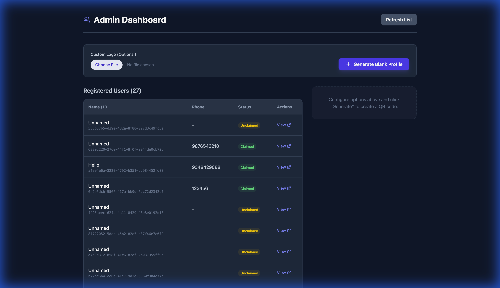
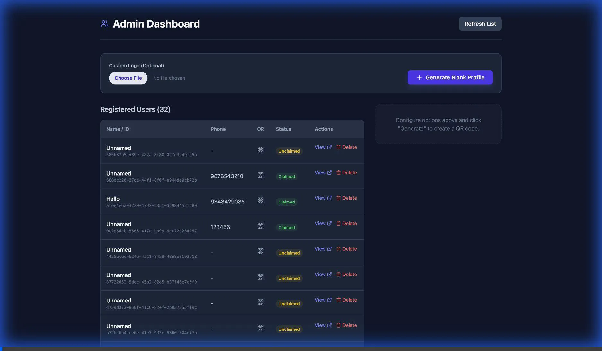
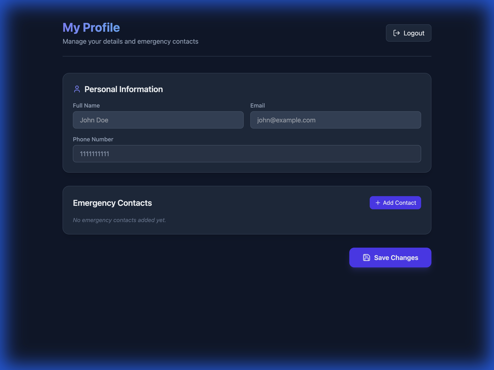

# QR Code Profile - Product Walkthrough

## Overview
A web application allowing users to manage their emergency profile and share it via a QR code.

## Quick Start

### 1. Start Backend
```bash
# In a terminal from project root
cd backend
python -m venv .venv
source .venv/bin/activate
pip install -r requirements.txt
uvicorn backend.main:app --reload
```
API will run at `http://localhost:8000`.

### 2. Start Frontend
```bash
# In a terminal from project root
cd frontend
npm install
npm run dev
```
App will run at `http://localhost:5173`.

## Features Guide

### Registration / Login
- Navigate to `/login`.
- Enter your phone number (e.g., `1234567890`) to sign in instantly.

### Admin Dashboard
Access via: `http://localhost:5173/admin`
- **List Users**: View all registered and unclaimed profiles.
- **Generate Profile**: Click "Generate Blank Profile" to create a new QR code.

### User Flow (New Profile)
1. **Scan QR**: Scan the blank QR code generated by Admin.
2. **Activate**: You will see an "Activate Profile" screen.
3. **Verify**: Enter your phone number and verify via OTP (Use `123456`).
4. **Claim**: The profile is now linked to your phone number.

### User Flow (Existing Profile)
- **Login**: Go to the login page. Enter your phone number -> OTP -> Dashboard.
- **Edit**: Update your name, email, photo, and contacts.
- **Public View**: Scan your QR code to see your emergency details.


*Recording of the automated test verifying the Admin Generation -> Profile Claim -> Login flow.*

### Admin Panel Enhancements
- **Custom Logo Upload**: Admins can now upload a custom logo (e.g., company brand) when generating a blank profile. This logo is embedded in the center of the QR code.
- **Improved Performance**: User listing now loads faster and excludes heavy image data.


*Screenshot of the Admin Dashboard showing the registered users list and QR generation tools.*

### Advanced Admin Features
- **Delete User**: Admins can remove users via a delete button with confirmation modal.
- **Download QR**: Integrated QR download button for each user in the list.


*Recording verifying user deletion and QR download functionality.*

### Simplified User Dashboard
- **Focused Interface**: The dashboard now focuses solely on "Personal Information" and "Emergency Contacts".
- **Clean Layout**: Removed the self-view QR code and image upload options to streamline the user experience.


*Screenshot of the simplified User Dashboard.*

### Public Profile
- Accessible via the QR code.
- Displays Name, Email, and a list of Emergency Contacts with "Tap to Call" functionality.
